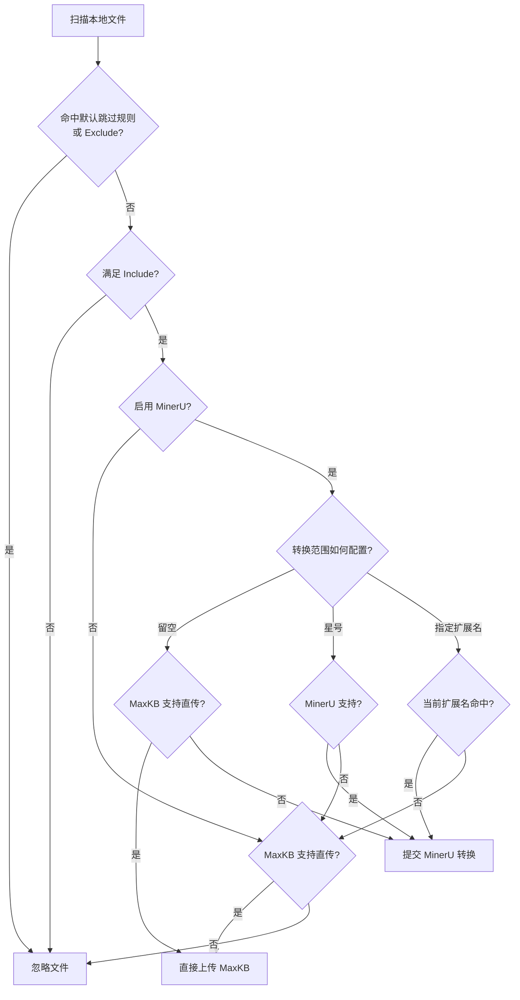
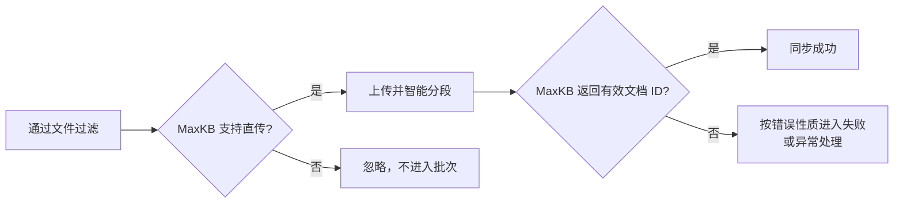
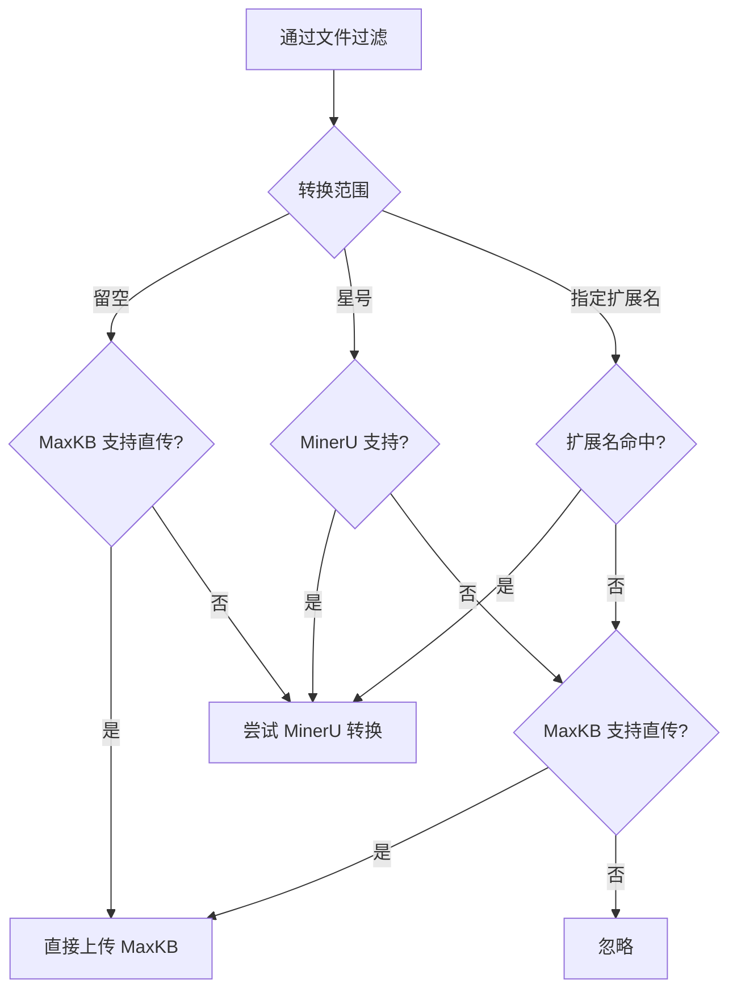
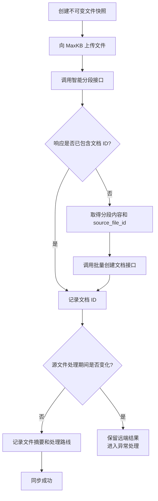
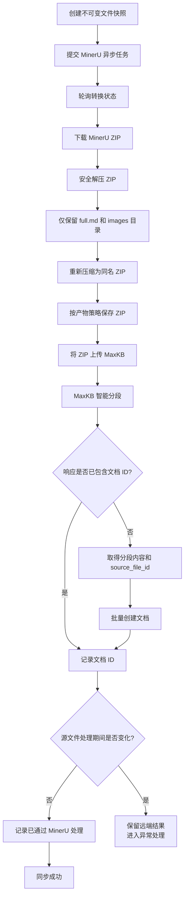
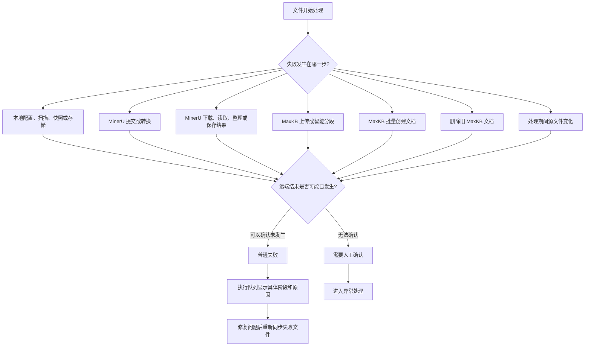
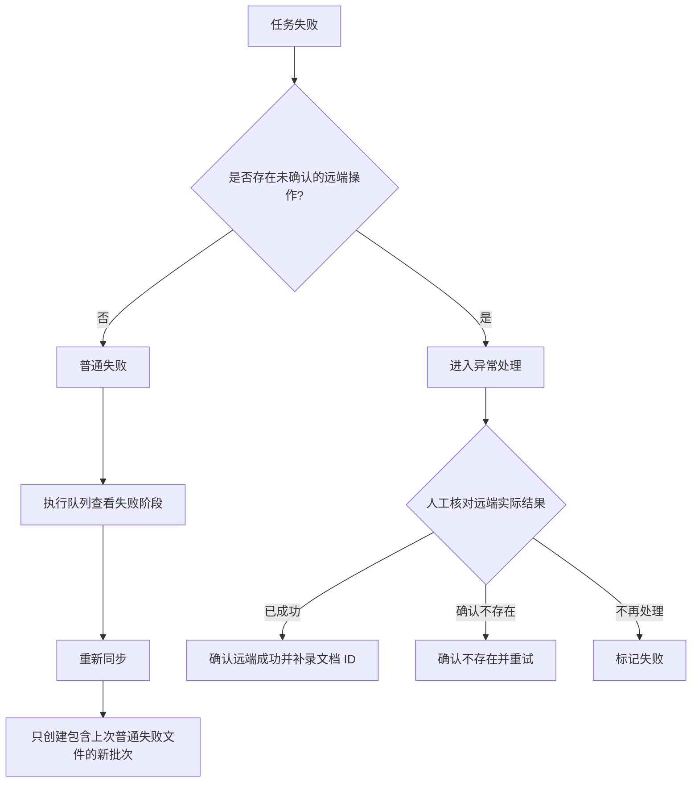
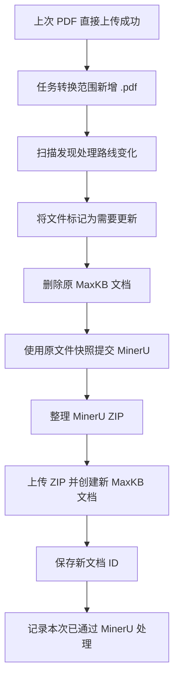

# MaxKB 本地文件同步工具操作手册

> 适用于 MaxKB 本地文件同步工具 1.0.0。本文介绍日常安装、配置和同步操作。
>
> 更新日期：2026 年 9 月 11 日

## 一、安装应用

### macOS

1. 双击下载的 `.dmg` 文件。
2. 将“MaxKB 本地文件同步工具”拖拽到 `Applications（应用程序）`。
3. 等待复制完成后关闭窗口。
4. 在 Finder 侧边栏推出 DMG 镜像。
5. 打开“应用程序”，双击启动应用。

macOS 安装包：

- Apple Silicon：`macos-arm64.dmg`
- Intel：`macos-x64.dmg`

### Windows

1. 双击 `.exe` 安装包。
2. 选择安装范围：
   - 仅当前用户安装；
   - 所有用户安装。
3. 选择安装目录。
4. 按照安装向导完成安装。
5. 从开始菜单或桌面快捷方式启动应用。

安装目录中会创建 `app`、`config`、`logs` 和 `data`。程序文件位于 `app`；安装器会为当前安装范围设置 `config/logs/data` 写权限。

| 安装范围 | 安装时 UAC | 启动应用时 UAC | 数据权限 |
| --- | ---: | ---: | --- |
| 仅当前用户 | 不需要 | 不需要 | 当前用户可以写入 `config/logs/data` |
| 所有用户 | 需要 | 不需要 | 本机普通用户可以写入 `config/logs/data` |

所有用户模式只在开始安装时弹出 UAC。安装完成页、开始菜单和桌面快捷方式启动应用时都使用普通权限。

### 关闭应用与系统托盘

Windows 点击窗口关闭按钮时，应用会显示“退出确认”：

- 选择 **“直接退出程序”**：停止后台同步并退出应用。
- 选择 **“最小化到系统托盘”**：应用继续在后台运行，同步任务和定时任务不受影响。可在右下角托盘区选择“显示应用”恢复窗口，或选择“退出应用”真正退出。
- 每次点击窗口关闭按钮都会重新询问，不保存上一次选择。

macOS 点击窗口关闭按钮时只关闭主窗口，应用继续在后台运行，定时任务不受影响。关闭主窗口后，Dock 不再显示应用运行指示点；可点击 Dock 中保留的应用图标，或通过顶部菜单栏图标选择“显示主界面”重新打开窗口。顶部菜单栏和 Dock 菜单中的“退出”会完全退出应用。

## 二、首次配置 MaxKB

1. 打开“系统设置”。
2. 进入“MaxKB 配置”。
3. 填写 **MaxKB Base URL**，例如：

   ```text
   https://your-maxkb.example.com
   ```

4. 填写 **User Key / API Key**。
5. 点击“保存配置”。保存后应用会自动进行真实连接校验。
6. 看到“配置已保存并校验成功”后，再进入“同步任务”页面创建任务。

如果校验失败，配置会保留为草稿，但工作空间和同步任务暂不可用。修正地址或 User Key 后重新点击“保存配置”即可。

注意：

- Base URL 不要填写具体接口路径，例如不要填写 `/admin/api/profile`。
- Base URL 支持 `http://` 和 `https://`；生产环境建议使用 HTTPS，内网测试环境可按实际部署填写 HTTP 地址。
- Base URL 末尾的 `/` 会自动处理。
- API Key 保存后不会完整显示。
- 应用不会复制浏览器 Cookie、Referer 或其他浏览器请求头。

## 三、配置 MinerU（可选）

如果只同步 MaxKB 可以直接上传的文件，可以关闭 MinerU。如果需要处理其他文档格式，再启用 MinerU。

1. 打开“系统设置” → “MinerU 配置”。
2. 打开“启用 MinerU 转换服务”。
3. 选择服务模式：
   - 在线 MinerU；
   - 内网 MinerU。
4. 填写服务地址和访问 Token（如服务需要）。
5. 选择 **产物保存目录**。启用 MinerU 时必须填写该目录。
6. 选择清理策略：
   - 不自动清理；
   - 立即清理；
   - 按批次清理；
   - 按时间清理。
7. 点击“测试连接”。
8. 点击“保存配置”。

MinerU 关闭时，配置项不可编辑；重新开启后，已保存的 Token 会自动复用，不需要再次输入。

### 产物保存说明

MinerU 处理后会生成 ZIP 产物。客户端会先解压并仅保留结果目录中的 `full.md` 和 `images/`，再压缩为同名 ZIP 交给 MaxKB 处理。产物目录用于保存处理后的 ZIP，清理策略决定它们何时删除。

- 选择“立即清理”：文件处理结束后清理不再需要的 ZIP。
- 选择“按批次清理”：保留最近指定批次，清理更早批次的产物。
- 选择“按时间清理”：保留指定时间范围内的产物，清理更早的文件。
- 正在执行或恢复中的批次不会被清理。

## 四、新建同步任务

1. 打开“同步任务”页面。
2. 点击“新建”。
3. 填写任务名称。
4. 选择本地文件夹。
5. 选择目标工作空间。
6. 选择知识库目录和知识库。
7. 配置同步规则：
   - Cron 定时表达式；
   - 是否同步删除的本地文件；
   - Include 规则；
   - Exclude 规则；
   - MinerU 转换范围。
8. 点击“保存”。

任务名称、本地文件夹、目标工作空间和知识库为必填项。任务名称去除首尾空格后不允许重复，英文字母大小写不同也视为同名；同一个本地文件夹可以创建多个任务。Include、Exclude 和扩展名规则保存前会校验格式。

### 文件匹配规则

- Include 为空：包含所有符合默认过滤规则的文件。
- Include 不为空：匹配任意 Include 规则的文件才会进入同步范围。
- Exclude 优先级最高，匹配 Exclude 的文件会被排除。
- 规则匹配对象是相对于同步根目录的路径，路径统一使用 `/`。
- 默认跳过隐藏文件、系统文件、临时文件、编辑器锁文件和符号链接。

保存任务前可以打开匹配预览，查看文件是否会同步以及被排除的原因。

## 五、文件处理规则与流程图

文件是否进入同步、直接上传 MaxKB，还是先经过 MinerU，由以下三类配置共同决定：

1. Include、Exclude 和默认过滤规则；
2. 文件格式是否受 MaxKB 或 MinerU 支持；
3. MinerU 是否开启，以及“MinerU 转换范围”的填写方式。

### 5.1 格式支持与处理结果

当前应用按以下格式能力进行判断：

- MaxKB 可直接上传：`.txt`、`.md`、`.markdown`、`.pdf`、`.docx`、`.html`、`.xls`、`.xlsx`、`.csv`、`.zip`。
- MinerU 可转换：`.pdf`、`.png`、`.jpg`、`.jpeg`、`.bmp`、`.tiff`、`.gif`、`.webp`、`.jp2`、`.docx`、`.pptx`、`.xlsx`。

| 文件格式示例 | MaxKB 直传 | MinerU 转换 | MinerU 关闭 | MinerU 开启，范围留空 | MinerU 开启，范围为 `*` | MinerU 开启，指定扩展名 |
| --- | --- | --- | --- | --- | --- | --- |
| `.pdf`、`.docx`、`.xlsx` | 支持 | 支持 | 直接上传 | 直接上传 | MinerU 转换 | 命中时转换，未命中时直传 |
| `.txt`、`.md`、`.html`、`.xls`、`.csv`、`.zip` | 支持 | 不支持 | 直接上传 | 直接上传 | 直接上传 | 未命中时直传；若错误地配置为转换范围，会在 MinerU 阶段失败 |
| `.pptx`、常见图片 | 不支持 | 支持 | 忽略 | MinerU 转换 | MinerU 转换 | 命中时转换，未命中时忽略 |
| `.doc`、其他双方均不支持的格式 | 不支持 | 不支持 | 忽略 | 尝试 MinerU，随后报告格式不支持 | 忽略 | 命中时尝试 MinerU 并失败，未命中时忽略 |

“忽略”表示该文件不会加入同步批次，也不会计为同步失败。建议转换范围只填写 MinerU 支持的扩展名；不确定时使用 `*`，可以避免把未知格式提交给 MinerU。

### 5.2 总体判断流程



### 5.3 MinerU 关闭时



例如 `.pdf`、`.docx`、`.txt` 和 `.zip` 会直接上传；`.pptx`、图片和 `.doc` 不会进入同步批次。

### 5.4 MinerU 开启时的三种转换范围



典型示例：

- 范围留空：`.pdf` 直接上传，`.pptx` 和图片通过 MinerU；`.doc` 会尝试 MinerU 后报告不支持。
- 范围为 `*`：`.pdf`、`.docx`、`.xlsx`、`.pptx` 和图片通过 MinerU；`.txt`、`.md`、`.csv`、`.zip` 等仍直接上传；`.doc` 被忽略。
- 范围为 `.pdf,.pptx`：PDF 和 PPTX 通过 MinerU，DOCX 直接上传；图片因未命中且不能直传而被忽略。

### 5.5 直接上传成功流程



MaxKB 返回有效文档 ID 后，应用立即认定文档创建成功，不等待 MaxKB 后续索引、向量化或问题生成完成。

### 5.6 MinerU 转换成功流程



上传给 MaxKB 的是整理后的完整 ZIP，而不是单独上传 `full.md`。ZIP 内的 `images/` 与 Markdown 图片引用会一起保留。

### 5.7 失败阶段与页面展示



执行队列会按实际阶段区分错误，常见类型包括：

| 错误阶段 | 常见原因 | 默认处理方式 |
| --- | --- | --- |
| 本地配置或文件快照 | 路径不可访问、文件读取失败、配置缺失 | 修复后重新同步 |
| MinerU 转换 | 认证失败、格式不支持、任务失败、状态异常、转换超时 | 修复配置或文件后重新同步 |
| MinerU 文件下载 | 下载超时、下载链接失效、网络异常 | 确认服务后重新同步 |
| MinerU 结果处理 | ZIP 为空、无法读取、结构无效、整理或保存失败 | 检查产物目录与 ZIP 内容后重新同步 |
| MinerU 产物上传 MaxKB | 上传失败、网络中断、MaxKB 拒绝文件 | 根据是否能确认远端结果决定重试或人工处理 |
| MaxKB 智能分段 | 超时、认证失败、权限不足、响应格式不兼容 | 明确失败可重试；结果不确定则人工处理 |
| MaxKB 文档创建 | `batch_create` 失败或未返回唯一文档 ID | 明确失败可重试；结果不确定则人工处理 |
| MaxKB 文档删除 | 删除旧文档失败 | 明确失败可重试；结果不确定则人工处理 |
| 本地文件变化 | 同步期间源文件内容发生变化 | 保留远端引用并人工确认 |
| 执行队列或本地系统 | 批次创建、队列写入、数据库或内部执行异常 | 查看错误详情和日志后处理 |

### 5.8 普通失败与异常处理



以下情况通常属于“远端结果不确定”：

- MinerU 任务提交时连接中断，无法确认服务端是否已创建任务；
- MaxKB 上传、智能分段、批量创建或删除时发生超时、连接中断、TLS 错误、HTTP 429 或服务端错误；
- 已存在远端引用，但本地处理快照缺失或损坏；
- MaxKB 已创建文档，但同步过程中本地源文件又发生变化。

这些操作不会自动重试，避免重复创建或误删文档。必须先在“异常处理”中选择“确认远端成功”“确认不存在并重试”或“标记失败”。

### 5.9 修改 MinerU 转换范围后的重传

应用会为每个成功文件记录上一次是否经过 MinerU。即使文件内容未变化，只要新配置计算出的处理路线与上一次不同，也会重新同步。



反向修改同样适用，例如从 `.pdf` 改为留空时，原先通过 MinerU 的 PDF 会删除旧文档并按 MaxKB 直传路线重新上传。

## 六、执行同步

### 立即同步

在同步任务列表中点击“立即同步”：

- 任务启用时，立即创建一个手动批次并进入执行队列。
- 任务关闭时，确认后只执行本次同步，不会重新开启定时调度。
- 如果目录没有文件变化，会显示“该目录下文件无变化，无需同步”。
- 如果上一次有失败文件，即使本次目录没有变化，也可以通过“重新同步”重新处理失败文件。

### 定时同步

任务启用且 Cron 表达式有效时，应用会按照操作系统时区定时创建批次。应用关闭期间错过的调度不会补跑。

关闭任务会停止后续定时调度，并取消尚未执行的排队批次；正在运行的批次继续完成，暂停批次保持暂停。

## 七、查看执行队列

打开“执行队列”可以查看任务的排队和执行情况。

1. 在队列列表中选择一个同步任务。
2. 进入后查看该任务下不同批次的执行详情。
3. 点击具体批次查看文件明细。
4. 失败文件可以查看错误原因和处理阶段。

批次支持以下操作：

- `QUEUED`：取消排队；
- `RUNNING`：暂停或停止；
- `PAUSED`：继续或停止；
- 终态批次：查看详情或重新同步。

暂停和停止会在当前文件处理到安全检查点后生效，不会回滚已经完成的上传、删除或文档创建操作。

批次详情中可以查看批次时间、文件总数、成功数、失败数、文件路径、处理阶段以及脱敏后的错误详情。MaxKB 返回有效文档 ID 后，客户端即记录该文件成功，不继续等待 MaxKB 后台索引完成。

## 八、异常处理

当上传、批次创建或删除的结果无法确认时，文件会进入“异常处理”页面。

处理步骤：

1. 打开“异常处理”。
2. 查看文件路径、操作阶段、远端引用和错误详情。
3. 根据真实服务端情况选择处理方式：
   - 确认远端已成功；
   - 确认远端不存在后重新处理；
   - 标记为失败，稍后处理。

不确定的上传、批次创建或删除操作不会自动重试，必须由人工明确决策后处理。

## 九、查看日志

应用日志默认保存在以下目录：

```text
Windows 安装版: <安装目录>\logs
Windows 开发版: %LOCALAPPDATA%\MaxKB\MaxKB 本地文件同步工具\logs
macOS:          ~/Library/Application Support/MaxKB/MaxKB 本地文件同步工具/logs
```

日志中会记录请求阶段、HTTP 状态、批次 ID、文件 ID 和脱敏后的错误信息，不会记录完整 API Key、Token、Cookie 或预签名 URL。

遇到问题时，建议提供：

- 发生问题的页面和操作；
- 任务名称和批次时间；
- 脱敏后的错误信息；
- 对应时间段的日志片段。

不要直接分享包含凭据或业务文件内容的日志。

## 十、常见问题

### 1. 页面一直处于 loading

先点击页面刷新按钮。如果仍未恢复：

1. 关闭并重新启动应用；
2. 查看日志中是否有启动、数据库或 Wails 调用错误；
3. 确认 MaxKB 配置已经测试连接成功；
4. 确认应用没有被系统防火墙或安全软件阻止。

### 2. MinerU 校验失败

检查：

- 服务模式是否选择正确；
- 服务地址是否包含正确的协议和路径；
- Token 是否有效；
- 内网服务的 `/health` 是否返回健康状态；
- 当前机器是否能访问 MinerU 服务。

### 3. MaxKB 返回格式错误

先在“执行队列”的批次详情中查看具体请求阶段和错误信息，再查看日志中的脱敏响应摘要。不要根据文档名称盲目删除远端文档，也不要重复提交不确定的操作；无法确认时请在“异常处理”页面人工处理。

### 4. 新建任务提示名称重复

任务名称必须唯一。请使用其他名称，或编辑已有的同名任务。同一个本地文件夹可以绑定多个同步任务。

### 5. 修改任务或删除任务会删除 MaxKB 文档吗

删除同步任务不会删除 MaxKB 文档，但会删除该任务在 MinerU 产物保存目录中的同名中间产物文件夹。修改目标知识库时，旧知识库文档也会保留。修改本地文件夹时，只处理当前任务记录的远端文档。

## 十一、数据和凭据安全

- API Key 和 Token 通过系统凭据库保存。
- 系统凭据库不可用时不会降级为明文保存。
- SQLite、日志和导出文件中不保存完整凭据。
- 卸载应用不会默认删除 Windows 安装目录中的 `config/logs/data` 或其他平台的用户数据；如需彻底清理，请先在应用中确认删除任务和凭据，再备份或清理对应目录。
