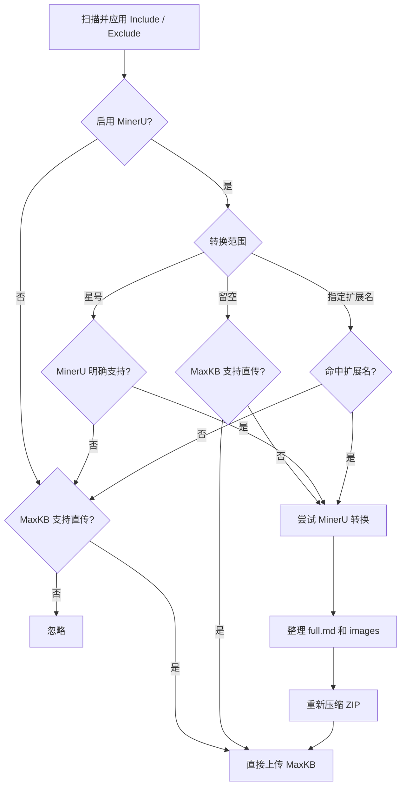
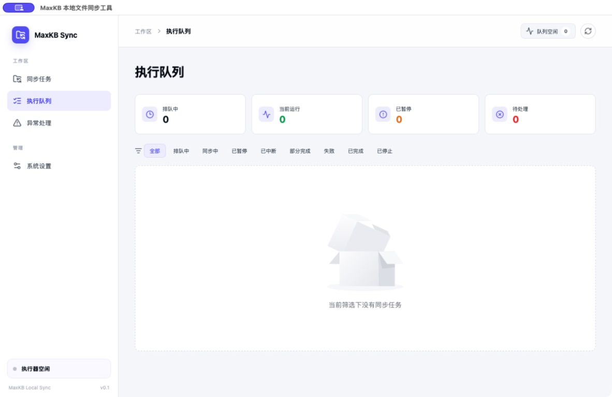
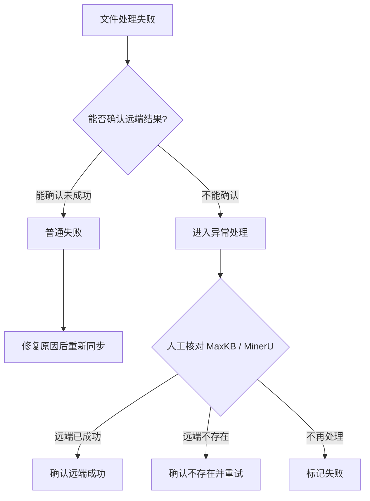

# MaxKB 本地文件同步工具用户手册

> 适用版本：1.0.0
>
> 更新日期：2026 年 9 月 14 日

## 一、产品用途

MaxKB 本地文件同步工具用于将本地文件夹中的资料持续同步到指定的 MaxKB 知识库。应用会递归扫描文件夹，识别新增、修改、删除和未变化的文件，只处理需要同步的内容。

对于 MaxKB 无法直接处理或需要提升解析效果的文件，可以先交给 MinerU 转换，再将整理后的 ZIP 上传到 MaxKB。

应用包含四个页面：

| 页面 | 主要用途 |
| --- | --- |
| 同步任务 | 新建、编辑、启用、关闭、删除和立即执行同步任务 |
| 执行队列 | 查看同步批次、文件处理进度、成功结果和失败原因 |
| 异常处理 | 人工确认远端结果不明确的上传、创建或删除操作 |
| 系统设置 | 配置 MaxKB、MinerU、请求超时、产物目录和清理规则 |

## 二、安装与退出

### 2.1 Windows

1. 双击 `.exe` 安装包。
2. 选择“仅当前用户”或“所有用户”。
3. 根据需要修改安装目录。
4. 完成安装后，从桌面或开始菜单启动应用。

Windows 点击关闭按钮时会询问本次操作：

- **最小化到系统托盘**：关闭主窗口，应用继续执行同步和定时任务；通过托盘菜单的“显示应用”恢复窗口。
- **直接退出应用**：停止后台运行并退出应用。

应用每次关闭都会重新询问，不保存上一次选择。

### 2.2 macOS

1. 双击 `.dmg` 文件并等待镜像挂载。
2. 将应用图标拖入 `Applications（应用程序）`。
3. 等待复制完成，关闭安装窗口并推出镜像。
4. 从“应用程序”中打开 MaxKB 本地文件同步工具。

关闭主窗口后，应用继续在后台运行，定时任务不受影响；此时可从顶部菜单栏选择“显示主界面”或“退出”。再次点击应用图标也会恢复主窗口，只有选择“退出”才会完全停止应用。

## 三、配置 MaxKB

首次使用时，先打开“系统设置”并进入“MaxKB 配置”。

1. 填写 **MaxKB Base URL**，例如 `https://maxkb.example.com`。
2. 填写 **User Key / API Key**。
3. 根据网络情况设置请求超时时间，默认 30 秒。
4. 点击“测试连接”。
5. 测试成功后点击“保存配置”。

注意事项：

- Base URL 支持 HTTP 和 HTTPS，不要填写 `/admin/api/...` 等具体接口路径。
- 内网环境可以按实际部署使用 HTTP，生产环境建议使用 HTTPS。
- API Key 保存后不会完整回显，并由操作系统凭据库管理。
- 连接测试会真实访问 MaxKB；测试失败时应先检查地址、网络、凭据和权限。

## 四、配置 MinerU

MinerU 为可选服务。仅同步 MaxKB 可直接处理的文件时，可以保持关闭。

1. 打开“系统设置”并进入“MinerU 配置”。
2. 打开“启用 MinerU 转换服务”。
3. 选择“在线 MinerU”或“内网 MinerU”。
4. 填写服务地址和访问 Token；不需要认证的内网服务可按实际配置处理。
5. 选择产物保存目录。MinerU 开启时，该目录必填。
6. 选择自动清理规则。
7. 点击“测试连接”，确认服务可用。
8. 点击“保存配置”。

切换在线和内网模式时，页面会清空当前地址及 Token，避免误用另一种服务的配置；在线 MinerU 的地址会恢复为 `https://mineru.net`。只关闭 MinerU 而不切换服务模式时，已保存的 Token 仍保留在系统凭据库中，再次开启不需要重复输入。

### 4.1 MinerU 产物

MinerU 返回 ZIP 后，应用会：

1. 安全解压 ZIP。
2. 在结果目录中保留 `full.md` 和 `images/`，删除其他中间文件。
3. 修正必要的 Markdown 图片分隔格式。
4. 重新压缩为与原产物同名的 ZIP。
5. 将整理后的整个 ZIP 上传到 MaxKB，而不是单独上传 `full.md`。

### 4.2 自动清理规则

| 规则 | 行为 |
| --- | --- |
| 立即清理 | 文件处理结束后清理不再需要的 ZIP |
| 按批次清理 | 保留最近指定批次，定时删除更早产物 |
| 按时间清理 | 保留指定小时或天数内的产物，定时删除更早产物 |
| 不自动清理 | 保留产物，由用户自行清理 |

正在执行或等待恢复的批次不会被自动清理。删除同步任务时，只删除该任务在 MinerU 产物目录中的同名任务文件夹，不删除其他任务的产物。

## 五、新建同步任务

打开“同步任务”，点击右上角“新建”。


依次完成以下配置：

1. 填写任务名称。
2. 选择本地文件夹。
3. 选择目标工作区、知识库目录和知识库。
4. 设置 Cron 定时表达式。
5. 选择是否同步本地删除操作。
6. 根据需要填写 Include 和 Exclude 规则。
7. 根据需要启用 MinerU，并填写 MinerU 转换范围。
8. 保存任务。

任务名称、本地文件夹、目标工作区和知识库为必填项。任务名称去除首尾空格后不能重复，英文字母大小写不同也视为同名。同一个本地文件夹可以用于多个同步任务。

### 5.1 文件筛选规则

- Include 为空时，包含所有通过默认过滤的文件。
- Include 不为空时，仅包含匹配任意 Include 正则的文件。
- Exclude 优先级更高，命中的文件始终排除。
- 匹配对象是相对于任务根目录的路径，并统一使用 `/`。
- 隐藏文件、系统文件、临时文件、编辑器锁文件和符号链接默认跳过。
- 匹配预览只展示有限数量的结果，避免大目录递归扫描时阻塞页面。

“忽略”或“排除”的文件不会加入同步批次，也不会计为失败。

## 六、文件格式与处理路线

### 6.1 支持格式

MaxKB 可直接上传：

`.txt`、`.md`、`.markdown`、`.pdf`、`.docx`、`.html`、`.xls`、`.xlsx`、`.csv`、`.zip`

MinerU 可转换：

`.pdf`、`.png`、`.jpg`、`.jpeg`、`.bmp`、`.tiff`、`.gif`、`.webp`、`.jp2`、`.docx`、`.pptx`、`.xlsx`

实际能力还取决于所连接的 MaxKB 和 MinerU 版本。

### 6.2 MinerU 转换范围

| 配置 | 处理方式 |
| --- | --- |
| MinerU 关闭 | 仅同步 MaxKB 可直接上传的格式 |
| MinerU 开启，范围留空 | MaxKB 支持的格式直接上传；其他格式尝试 MinerU |
| MinerU 开启，范围为 `*` | MinerU 明确支持的格式全部转换；其余 MaxKB 格式直接上传 |
| MinerU 开启，填写 `.pdf,.pptx` 等 | 命中的格式通过 MinerU；未命中的格式按 MaxKB 直传能力处理 |

典型示例：

- 范围留空：PDF 和 DOCX 直接上传，PPTX 和常见图片通过 MinerU。
- 范围为 `*`：PDF、DOCX、XLSX、PPTX 和常见图片通过 MinerU；TXT、Markdown、CSV 和 ZIP 直接上传。
- 范围为 `.pdf,.pptx`：PDF 和 PPTX 通过 MinerU，DOCX 直接上传，未命中的图片被忽略。



### 6.3 配置变化时重新同步

应用会记录每个文件上一次是否通过 MinerU。即使文件内容未变化，只要当前处理路线与上一次不同，也会重新同步。

例如：某个 PDF 上次直接上传，之后将转换范围改为 `.pdf`，应用会删除自身记录的原 MaxKB 文档，再将 PDF 交给 MinerU 转换并上传新 ZIP。反向修改时也会重新同步。

## 七、执行同步

### 7.1 立即同步

在任务卡片中点击“立即同步”，应用会扫描目录并创建同步批次。

- 任务正在处理中时，按钮显示“处理中”且不可重复点击。
- 目录没有变化且没有历史失败文件时，提示“该目录下文件无变化，无需同步”。
- 上一次存在普通失败文件时，即使目录没有变化，也可以重新同步失败文件。
- 重新同步只处理上一次可重试的失败文件，不重复处理已成功且未变化的文件。

### 7.2 定时同步

任务开启且 Cron 表达式有效时，应用按照操作系统时区定时创建批次。应用完全退出期间错过的调度不会补跑。

关闭同步任务会停止后续定时调度，并取消尚未执行的排队批次；正在运行的批次继续处理，已经暂停的批次保持暂停。

## 八、执行队列

“执行队列”按同步任务展示批次和文件处理结果。



1. 选择一个同步任务。
2. 查看该任务下的批次记录。
3. 打开批次，查看文件路径、当前阶段、成功或失败状态。
4. 根据失败阶段和错误详情修复问题，再重新同步。

批次支持的操作取决于当前状态：

| 状态 | 可用操作 |
| --- | --- |
| 排队中 | 取消排队 |
| 处理中 | 暂停、停止 |
| 已暂停 | 继续、停止 |
| 已完成或失败 | 查看详情；符合条件时重新同步 |

暂停和停止会在当前文件到达安全检查点后生效，不会回滚已经完成的上传、文档创建或删除。

MaxKB 返回有效文档 ID 后，该文件即记为同步成功。应用不会等待 MaxKB 后续的索引、向量化或问题生成完成。

## 九、失败与异常处理

### 9.1 普通失败

能够确认远端操作未成功的错误记为普通失败，例如本地文件读取失败、明确的认证失败、MinerU 返回失败状态或无效 ZIP。修复原因后，可以从任务或批次重新同步。

执行队列会标明失败发生的步骤，常见类型包括：

| 阶段 | 常见问题 |
| --- | --- |
| 本地扫描或快照 | 文件夹不可访问、文件被删除、读取权限不足 |
| MinerU 任务提交或转换 | 认证失败、格式不支持、任务失败、状态异常、转换超时 |
| MinerU 文件下载 | 下载链接失效、下载超时、网络异常 |
| MinerU 结果处理 | ZIP 为空、结构无效、整理或保存失败 |
| MinerU 产物上传 MaxKB | MaxKB 拒绝文件、网络中断、请求失败 |
| MaxKB 智能分段 | 权限不足、响应格式异常、请求失败 |
| MaxKB 文档创建 | 创建失败、响应中没有唯一文档 ID |
| MaxKB 文档删除 | 原文档删除失败 |

### 9.2 需要人工确认

上传、智能分段、文档创建或删除过程中发生超时、断网、TLS 错误、HTTP 429 或服务端错误时，客户端可能无法判断远端是否已经执行。此类操作不会自动重试，而是进入“异常处理”，以免生成重复文档或误删数据。



处理步骤：

1. 打开“异常处理”。
2. 查看任务、文件、操作阶段、远端引用和脱敏后的错误详情。
3. 在 MaxKB 或 MinerU 中核对真实结果。
4. 选择“确认远端成功”“确认不存在并重试”或“标记失败”。

## 十、任务修改与删除

- 修改 Include、Exclude、转换范围或 MinerU 开关后，下一次扫描会按新规则判断文件。
- 处理路线变化会触发重新上传，即使文件 MD5 没有变化。
- 删除任务不会删除 MaxKB 中已创建的文档。
- 删除任务会删除该任务自己的 MinerU 中间产物文件夹，包括空文件夹。
- 客户端只根据自身保存的远端文档 ID 执行删除，不按文件名猜测或删除其他来源的文档。

## 十一、常见问题

### 工作区或知识库没有可选项

先返回“系统设置”，确认 MaxKB 地址和 API Key 已保存且测试连接成功。仍无数据时，检查当前账号是否有对应工作区和知识库的访问权限。

### 文件没有进入同步批次

依次检查文件是否命中 Exclude、是否满足 Include、是否被默认规则跳过，以及当前处理路线是否支持该扩展名。被忽略的文件不属于失败。

### 页面长时间没有更新

点击页面右上角的刷新按钮。该按钮只重新获取当前页面的数据，不会启动同步任务，也不会重启应用。仍未恢复时，重新打开应用并查看对应时间段日志。

### MinerU 测试连接失败

检查服务模式、地址、Token 和本机网络。内网 MinerU 的 `/health` 应返回健康状态及版本号；CPU 部署通常使用 `pipeline` 后端。

### MaxKB 显示仍在索引中

这是 MaxKB 后台处理状态，不代表本地同步失败。只要文档创建接口返回有效文档 ID，本地同步就会记为成功。

### 删除任务后 MaxKB 文档仍存在

这是预期行为。删除任务只删除本地任务配置、相关本地记录和该任务的 MinerU 中间产物，不删除 MaxKB 文档。

## 十二、数据、日志与凭据

默认数据位置：

```text
Windows 安装版: <安装目录>\data
Windows 开发版: %LOCALAPPDATA%\MaxKB\MaxKB 本地文件同步工具\data
macOS:          ~/Library/Application Support/MaxKB/MaxKB 本地文件同步工具/data
```

日志位置：

```text
Windows 安装版: <安装目录>\logs
Windows 开发版: %LOCALAPPDATA%\MaxKB\MaxKB 本地文件同步工具\logs
macOS:          ~/Library/Application Support/MaxKB/MaxKB 本地文件同步工具/logs
```

- MaxKB API Key、在线 MinerU Token 和内网网关 Token 由系统凭据库管理。
- 完整凭据不会写入 SQLite、日志或导出文件。
- 系统凭据库不可用时，应用不会降级为明文保存。
- 错误详情和响应摘要会过滤 Authorization、Token、Cookie 和预签名 URL 等敏感内容。
- 升级和卸载默认保留任务、数据库、日志和系统凭据。

反馈问题时，请提供任务名称、批次时间、失败阶段和脱敏后的错误详情，不要发送 API Key、Token 或包含业务文件内容的日志。
